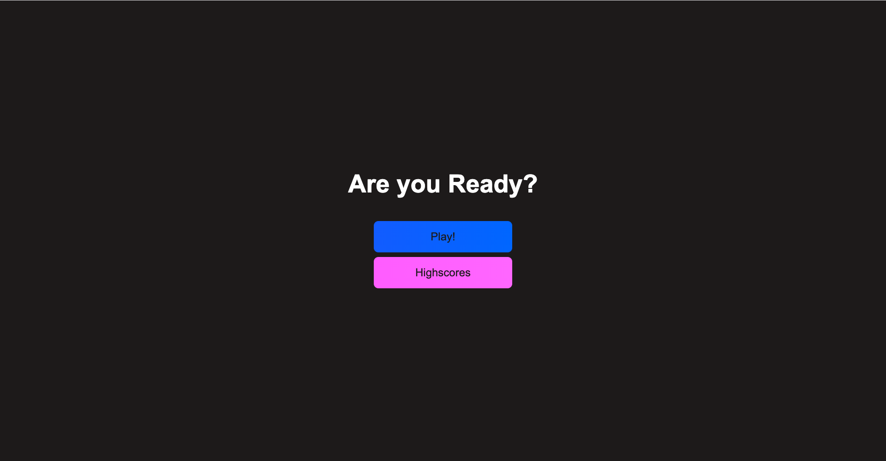
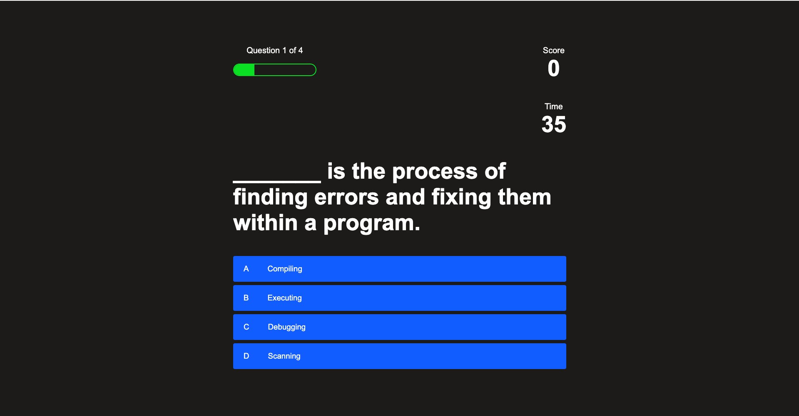
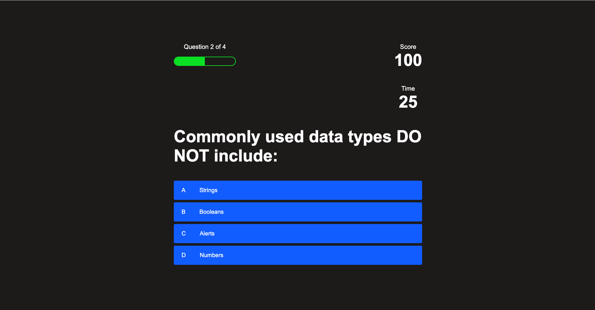
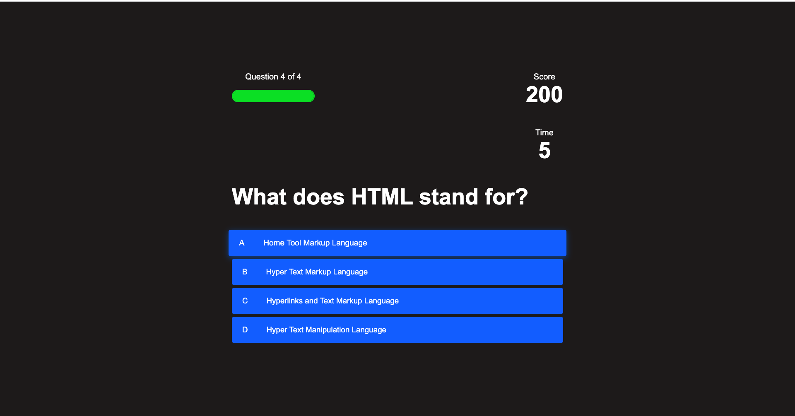
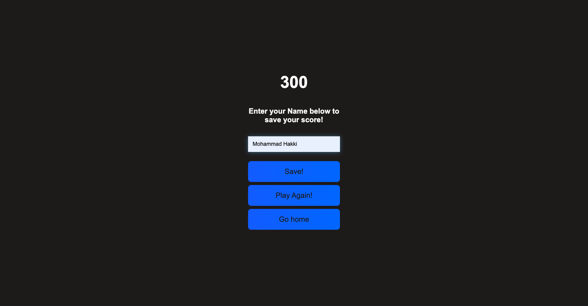
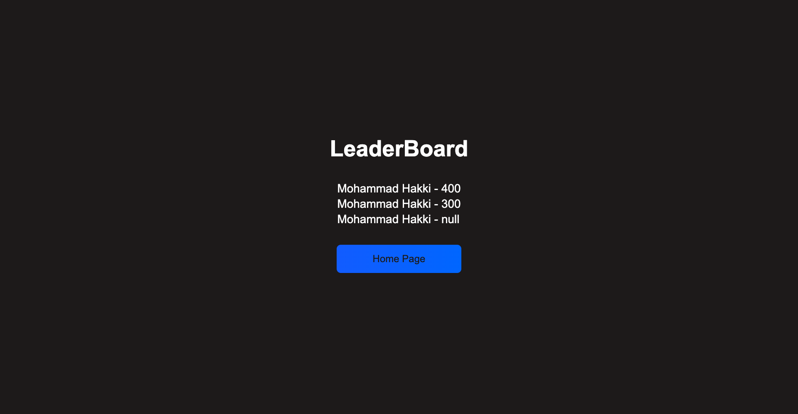

# Code-Quiz

## Description

This quiz is MCQ type of quiz. The user starts the quiz and there is a timer where of 60 seconds to answer all 4 questions. A progress bar and a score indicates whether the user has choosen the correct or incorrect choice. After the quiz has been completed or the timer is up, the user can input his name to save his/her highscore in the leaderboard.

## What have we done

1- Creat

This is a Code Quiz designed by using HTML, CSS and JavaScript.

## Screenshots

## Link to the deployed application

You can view the deployed application [here](https://hakki1810.github.io/Hakki-CodeQuiz/).

## Link to the Github repository

You can access the Github repository [here](https://github.com/Hakki1810/Hakki-CodeQuiz).
